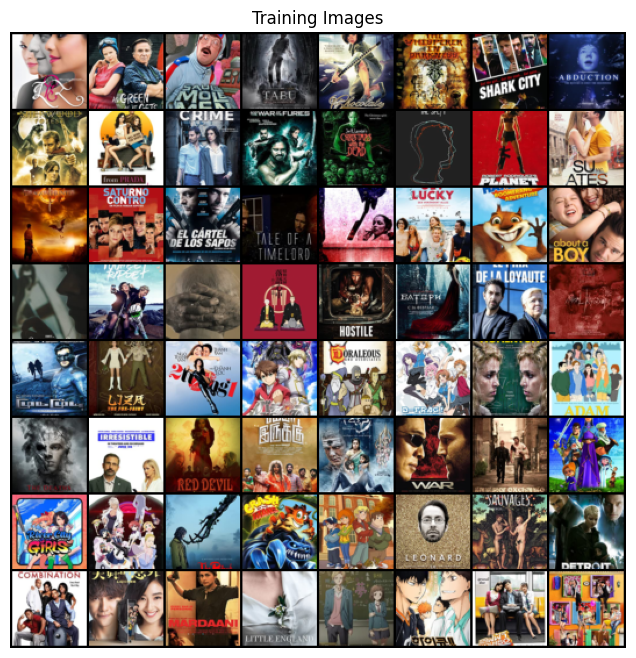
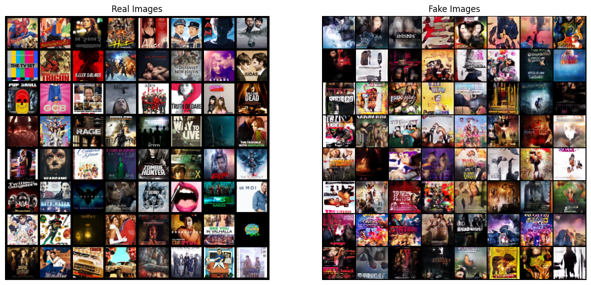
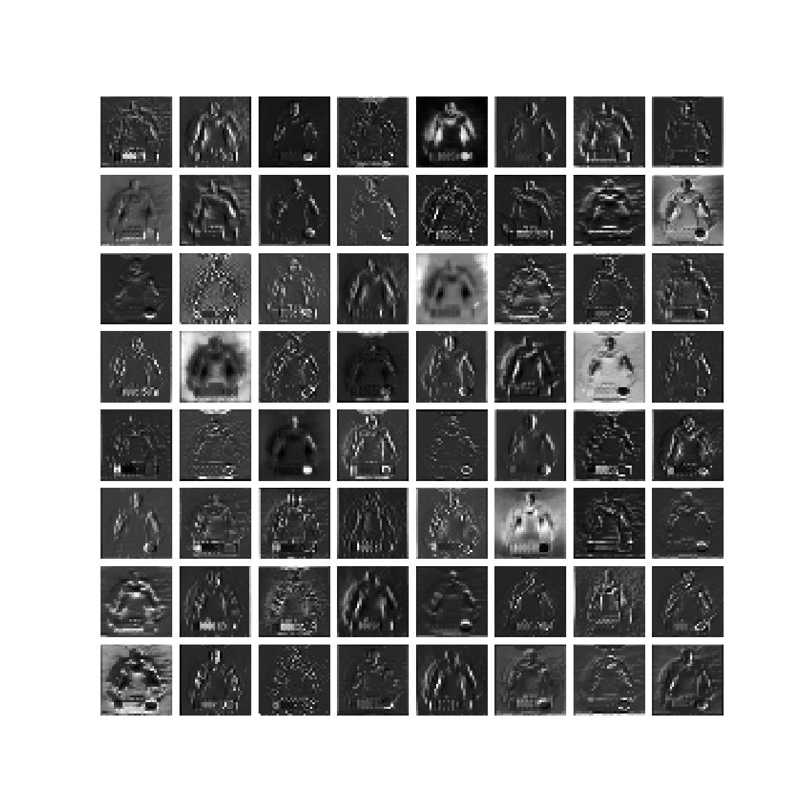
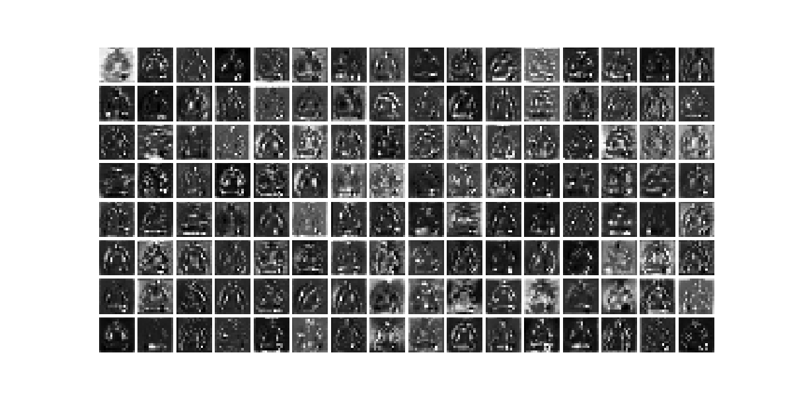
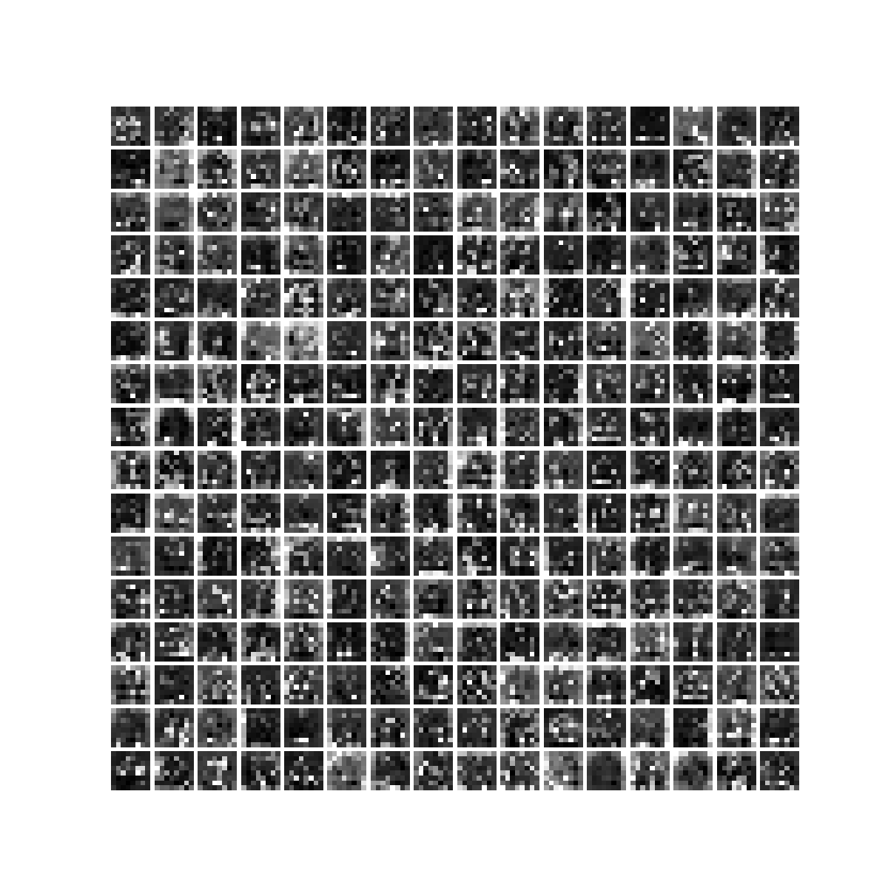
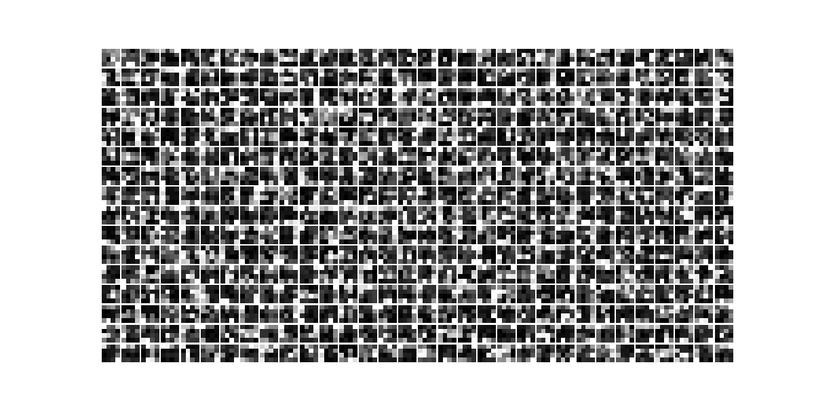
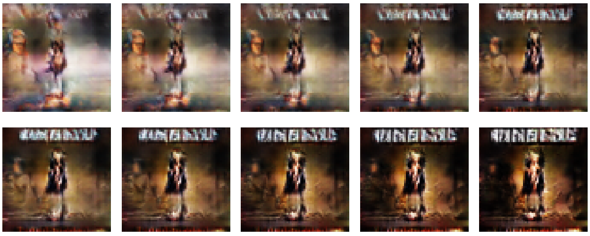
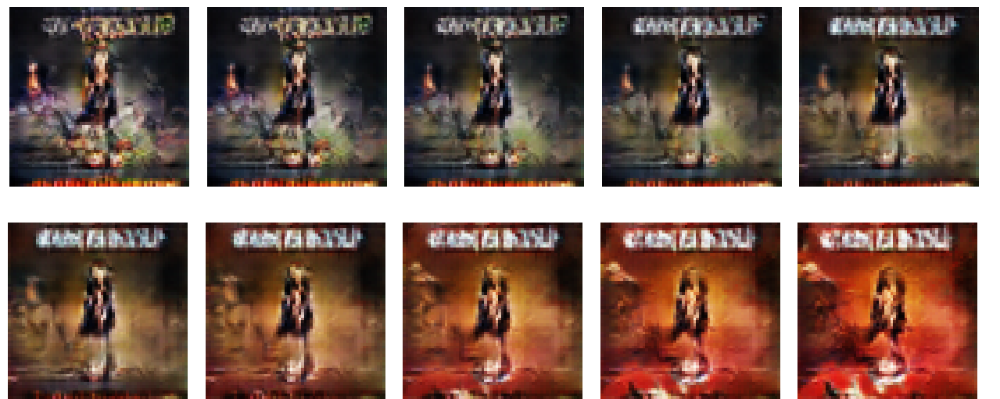

# Introduction
Our goal is to analyze the inner knowledge and decisions of a convolutional Generative Adversarial Network. The task of this model will be to generate new images from random noise, after being trained on a dataset of IMDb movie posters. Once satisfactory results are obtained, we will analyze both the discriminator and the generator:
- For the first one, we will try to understand how does it take a decision ; what is the information extracted from every filter and how does the information is encoded into the feature space. In order to achieve this, we will look for patterns or similarities in the neurons’ activation map between similar input images ; semantically or visually.
- For the generator, we will study how the initial noise is interpreted, and what transformations are applied by each layer. We will look at how the generated image varies while changing values of the input noise, one by one. We will also try to visualise different channels from different hidden layers’ feature map to see the complete evolution

# Dataset

This is the movie posters dataset:
- crawl from IMDb (api: https://www.omdbapi.com/)
- kaggle dataset (link: https://www.kaggle.com/datasets/dadajonjurakuziev/movieposter)

- Example of training dataset


# GAN Model


# Architecture
### Discriminator
```
Discriminator(
  (layers): Sequential(
    (0): Conv2d(3, 64, kernel_size=(4, 4), stride=(2, 2), padding=(1, 1), bias=False)
    (1): LeakyReLU(negative_slope=0.2, inplace=True)
    (2): Conv2d(64, 128, kernel_size=(4, 4), stride=(2, 2), padding=(1, 1), bias=False)
    (3): BatchNorm2d(128, eps=1e-05, momentum=0.1, affine=True, track_running_stats=True)
    (4): LeakyReLU(negative_slope=0.2, inplace=True)
    (5): Conv2d(128, 256, kernel_size=(4, 4), stride=(2, 2), padding=(1, 1), bias=False)
    (6): BatchNorm2d(256, eps=1e-05, momentum=0.1, affine=True, track_running_stats=True)
    (7): LeakyReLU(negative_slope=0.2, inplace=True)
    (8): Conv2d(256, 512, kernel_size=(4, 4), stride=(2, 2), padding=(1, 1), bias=False)
    (9): BatchNorm2d(512, eps=1e-05, momentum=0.1, affine=True, track_running_stats=True)
    (10): LeakyReLU(negative_slope=0.2, inplace=True)
    (11): Conv2d(512, 1, kernel_size=(4, 4), stride=(1, 1), bias=False)
    (12): Sigmoid()
  )
)
```

### Generator
```
Generator(
  (layers): Sequential(
    (0): ConvTranspose2d(100, 512, kernel_size=(4, 4), stride=(1, 1), bias=False)
    (1): BatchNorm2d(512, eps=1e-05, momentum=0.1, affine=True, track_running_stats=True)
    (2): ReLU(inplace=True)
    (3): ConvTranspose2d(512, 256, kernel_size=(4, 4), stride=(2, 2), padding=(1, 1), bias=False)
    (4): BatchNorm2d(256, eps=1e-05, momentum=0.1, affine=True, track_running_stats=True)
    (5): ReLU(inplace=True)
    (6): ConvTranspose2d(256, 128, kernel_size=(4, 4), stride=(2, 2), padding=(1, 1), bias=False)
    (7): BatchNorm2d(128, eps=1e-05, momentum=0.1, affine=True, track_running_stats=True)
    (8): ReLU(inplace=True)
    (9): ConvTranspose2d(128, 64, kernel_size=(4, 4), stride=(2, 2), padding=(1, 1), bias=False)
    (10): BatchNorm2d(64, eps=1e-05, momentum=0.1, affine=True, track_running_stats=True)
    (11): ReLU(inplace=True)
    (12): ConvTranspose2d(64, 3, kernel_size=(4, 4), stride=(2, 2), padding=(1, 1), bias=False)
    (13): Tanh()
  )
)
```

# Result

### Training result
- Training loss


- Compare real and fake images:


### XAI for Discriminator:
This section describes how the discriminator learns from the image.

- Input images will be cropped to have the same size

Input image            |  Crop image
:-------------------------:|:-------------------------:
|  

After analyzing the feature maps generated by the discriminator, it is clear that the model has learned to progressively focus on general object features and then on specific aspects of the input images.

- Activation map 1   

- Activation map 4

- Activation map 7

- Activation map 10


### XAI for Generator

Changes of images when modify the input noise




# Discussion

## Problems
- Upon analyzing the results obtained from the movie poster generation process, two main challenges can be observed. Firstly, the simplicity of the employed GAN model limits its ability to learn the complex patterns and diverse elements found in movie posters. Unlike face images or objects that have relatively simple patterns to recognize, movie posters encompass various styles, layouts, color tones, and titles, which can vary based on the genres they represent. This complexity makes it a more complex task for the GAN model to grasp, resulting in generated images that lack meaningful content and suffer from low resolution.
- Secondly, the low resolution of the input images further hampers the model’s ability to capture detailed features. Due to the need for uniformity in input size, the images are cropped, leading to a deterioration in resolution. This reduction in resolution prevents the model from effectively learning and representing intricate details, resulting in a loss of visual quality and coherency in the generated images.
## Solution
To address these challenges, two potential solutions can be considered. Firstly, employing Conditional GANs (CGANs) can enhance the model’s performance by conditioning it on the movie genre. By providing the model with additional information about the genre, it may gain a better understanding of the diverse elements associated with each genre, ultimately improving the quality and relevance of the generated posters. Additionally, including higher-resolution movie posters into the dataset or exploring the use of Progressive GANs (PGANs) can help enhance the resolution and overall quality of the generated images.